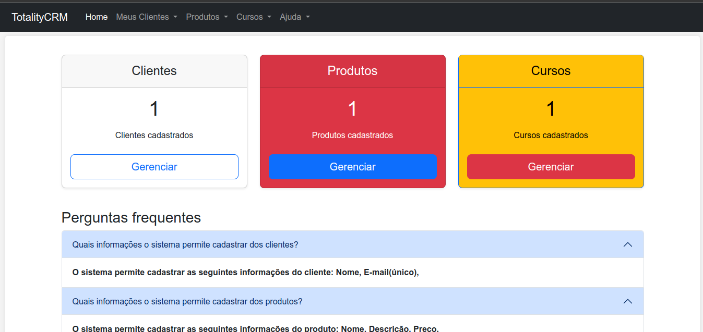
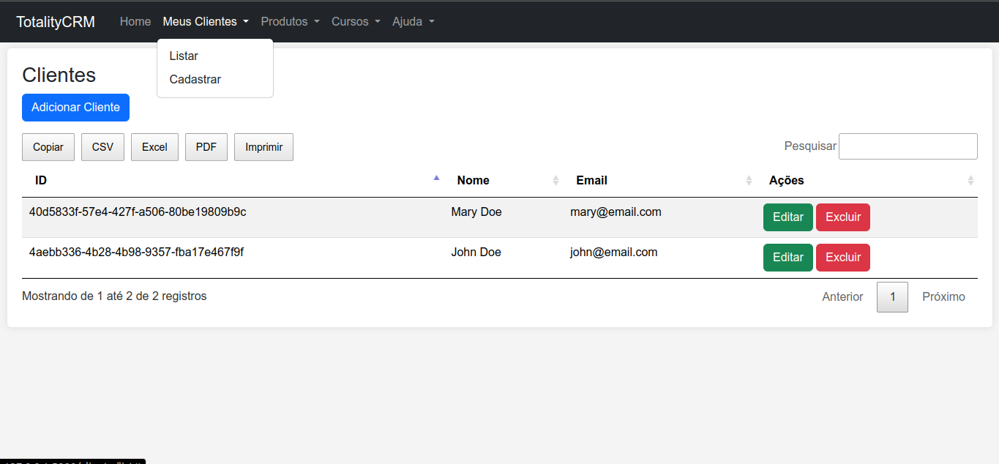
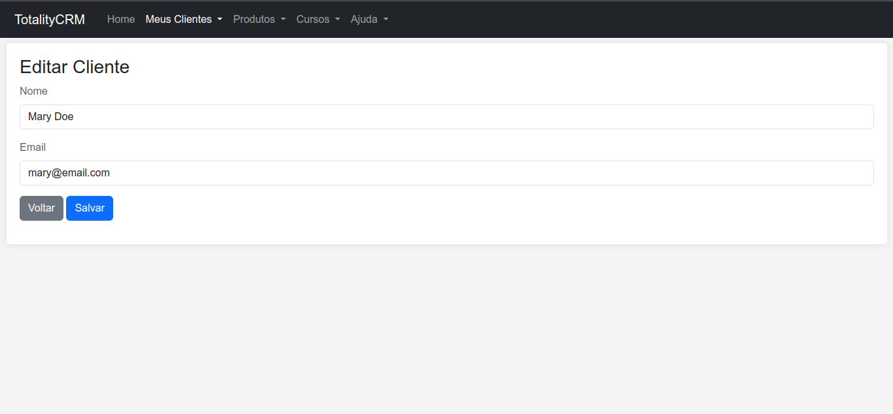
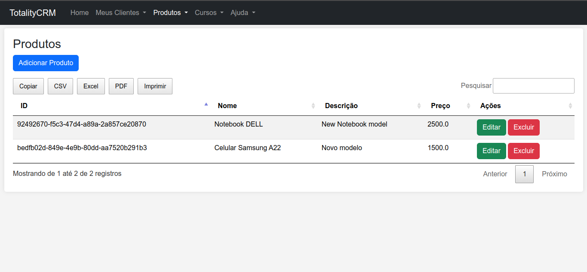
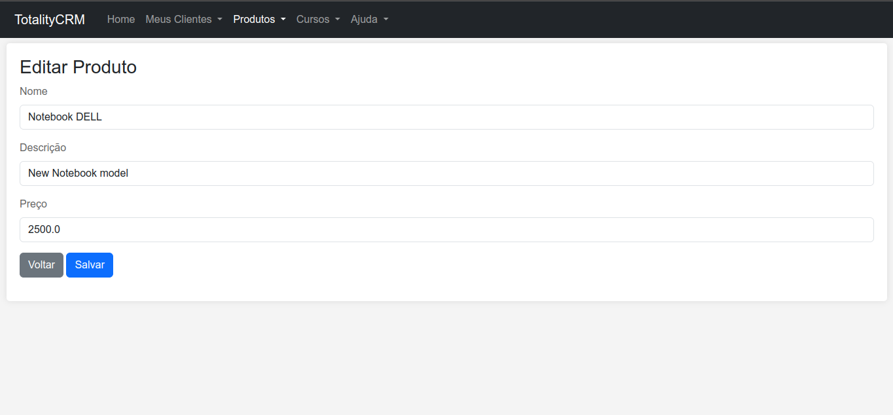
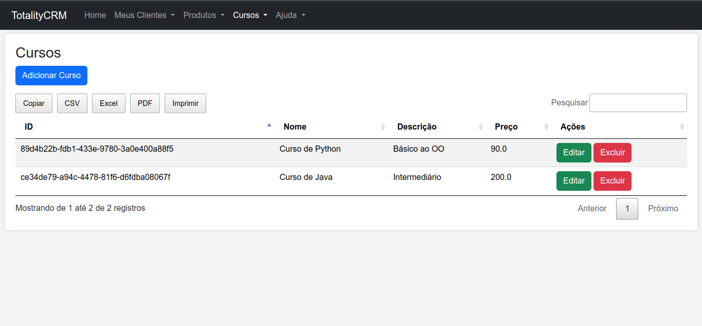
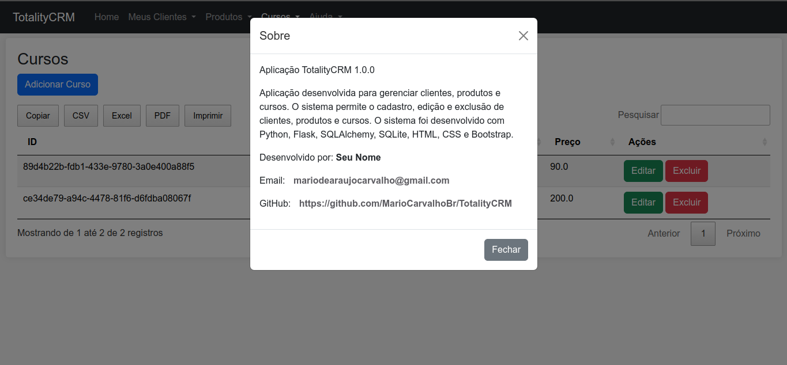

# Projeto TotalityCRM

## Descrição

TotalityCRM é uma aplicação web desenvolvida em Flask para gerenciar informações de clientes. Os dados são armazenados em um banco de dados SQLite. A aplicação permite adicionar, editar, visualizar e excluir clientes.

## Pré-requisitos

Antes de iniciar, certifique-se de ter o Python instalado em sua máquina. Esta aplicação foi desenvolvida utilizando Python 3.8 no Ubuntu.

## Instalação

### Clonar o Repositório

```bash
git clone https://github.com/seu_usuario/TotalityCRM.git
cd TotalityCRM
```

### Configurar Ambiente Virtual

```bash
conda create -n flask python=3.8
conda activate flask
```

### Instalar Dependências

```bash
pip install -r requirements.txt
```
# Instalar SQLite para testes
```bash
pip install sqlite3
```

### Configuração

Certifique-se de que todas as dependências estão instaladas e o ambiente virtual está ativado.

### Inicializar o Banco de Dados

```bash
python init_db.py
```

## Execução

Para rodar a aplicação, utilize o seguinte comando:

```bash
python run.py
```

Acesse a aplicação em `http://127.0.0.1:5000/`.

## Funcionalidades

**CLIENTES:**
- **Adicionar Cliente:** Permite adicionar um novo cliente ao banco de dados.
- **Visualizar Clientes:** Lista todos os clientes cadastrados.
- **Editar Cliente:** Permite editar informações de um cliente existente.
- **Excluir Cliente:** Permite excluir um cliente do banco de dados.

**PRODUTOS**
- **Adicionar Produto:** Permite adicionar um novo produto ao banco de dados.
- **Visualizar Produtos:** Lista todos os produtos cadastrados.
- **Editar Produto:** Permite editar informações de um produto existente.
- **Excluir Produto:** Permite excluir um produto do banco de dados.

**CURSOS**
- **Adicionar Curso:** Permite adicionar um novo curso ao banco de dados.
- **Visualizar Cursos:** Lista todos os cursos cadastrados.
- **Editar Curso:** Permite editar informações de um curso existente.
- **Excluir Curso:** Permite excluir um curso do banco de dados.

## Screenshots
|  |  |
|---------------------------------------|---------------------------------------|
|  |  |
|  |  |
|  |                                       |